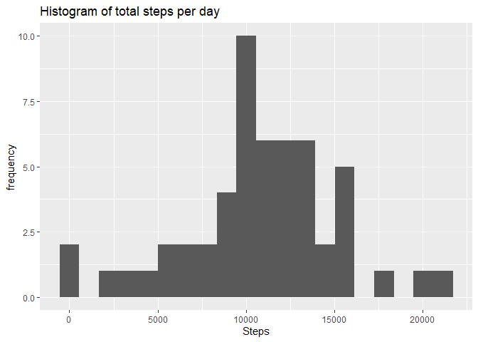
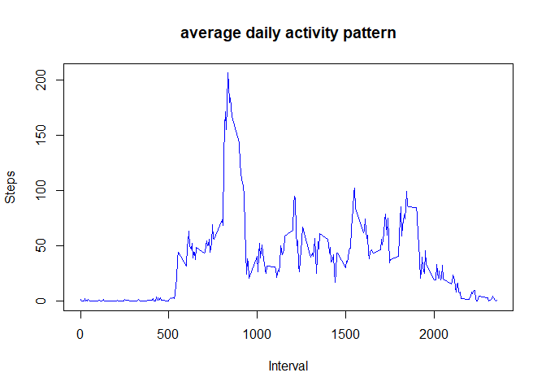
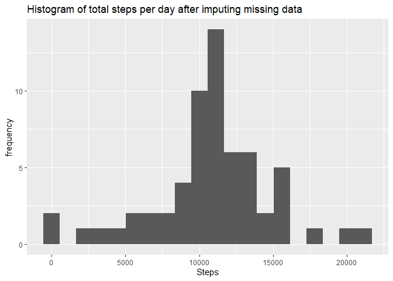
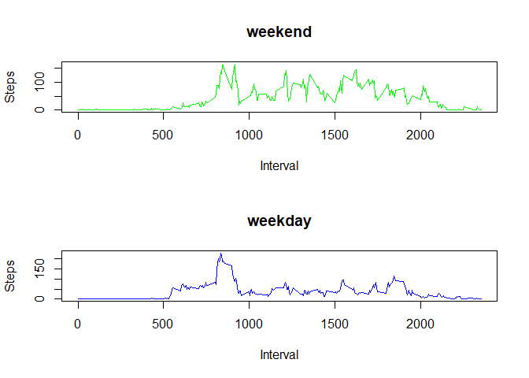

# 1 Code for reading in the dataset and/or processing the data


```r
library(ggplot2)
library(tidyverse)
```

```
## -- Attaching packages ------------------------------------------------------ tidyverse 1.3.0 --
```

```
## v tibble  2.1.3     v dplyr   0.8.4
## v tidyr   1.0.2     v stringr 1.4.0
## v readr   1.3.1     v forcats 0.5.0
## v purrr   0.3.3
```

```
## -- Conflicts --------------------------------------------------------- tidyverse_conflicts() --
## x dplyr::filter() masks stats::filter()
## x dplyr::lag()    masks stats::lag()
```

```r
library(readr)
activitydata <- read_csv("C:/Users/User/Desktop/activity.csv", 
    col_types = cols(steps = col_integer()))
```


**Finding mean total number of steps taken per day, ignoring NA values and plotting it on a histogram.**


```r
stepsperday<-summarise(group_by(activitydata,date),steps=sum(steps))
qplot(stepsperday$steps,bins=20,main="Histogram of total steps per day",xlab = "Steps",ylab = "frequency")
```

```
## Warning: Removed 8 rows containing non-finite values (stat_bin).
```

<!-- -->

**Calculating the mean and median of the number of steps taken per day.**


```r
mean(stepsperday$steps,na.rm = TRUE)
```

```
## [1] 10766.19
```

```r
median(stepsperday$steps,na.rm = TRUE)
```

```
## [1] 10765
```

**Calculating and plotting average daily pattern.**


```r
meandailyactivity<-summarise(group_by(activitydata,interval),steps=mean(steps,na.rm = TRUE))
plot(meandailyactivity$interval,meandailyactivity$steps,type = "l",col="blue",main = "average daily activity pattern",xlab = "Interval",ylab = "Steps")
```

<!-- -->

**5-minute interval containing the maximum number of steps (averaged across all days)**


```r
meandailyactivity[which.max(meandailyactivity$steps),]$interval
```

```
## [1] 835
```

**Now to input missing values, first calculating the number of NA values;**


```r
missingvalues<-sum(is.na(activitydata$steps))
missingvalues
```

```
## [1] 2304
```

**Inputting missing values by using mean for that 5 minute interval**


```r
impdata<-activitydata
for(i in 1:nrow(impdata)){
  if (is.na(impdata$steps[i])){
    impdata$steps[i] <- meandailyactivity[which(impdata$interval[i] == meandailyactivity$interval), ]$steps
  }
}
```

**Now confirming that new data set called impdata doesnt have NA values**


```r
sum(is.na(impdata))
```

```
## [1] 0
```

**Now plotting histogram of the total number of steps taken each day after imputing missing data**


```r
stepsperday2<-summarise(group_by(impdata,date),steps=sum(steps))
qplot(stepsperday2$steps,bins=20,main="Histogram of total steps per day after imputing missing data",xlab = "Steps",ylab = "frequency")
```

<!-- -->

**Now the new mean and median after imputing NA values are;**


```r
mean(stepsperday2$steps,na.rm = TRUE)
```

```
## [1] 10766.19
```

```r
median(stepsperday2$steps,na.rm = TRUE)
```

```
## [1] 10766.19
```


```r
weekdaysvector<-c("Monday","Tuesday","Wednesday","Thursday","Friday")
datevar<-as.Date(impdata$date)
weekdaysempty<-vector()
for(i in 1:length(datevar)){
  if(weekdays(datevar[i]) %in% weekdaysvector){
    weekdaysempty[i]<-"weekday"
  } else{
    weekdaysempty[i]<-"weekend"
  }
}
impdata$weekdays<-weekdaysempty
```

**Now creating subsets of impdata for weekdays and weekends**


```r
weekdayset<-subset(impdata,impdata$weekdays=="weekday")
weekendset<-subset(impdata,impdata$weekdays=="weekend")
```

**Now finding mean daily activities for weekdays and weekends**


```r
meanweekday<-summarise(group_by(weekdayset,interval),steps=mean(steps,na.rm = TRUE))
meanweekend<-summarise(group_by(weekendset,interval),steps=mean(steps,na.rm = TRUE))
```

**Now Plotting the mean daily activities for weekdays and weekends**


```r
par(mfrow=c(2,1))
plot(meanweekend$interval,meanweekend$steps,type = "l",col="green",xlab = "Interval",ylab = "Steps",main="weekend")
plot(meanweekday$interval,meanweekday$steps,type = "l",col="blue",main = "weekday",xlab = "Interval",ylab = "Steps")
```

<!-- -->

